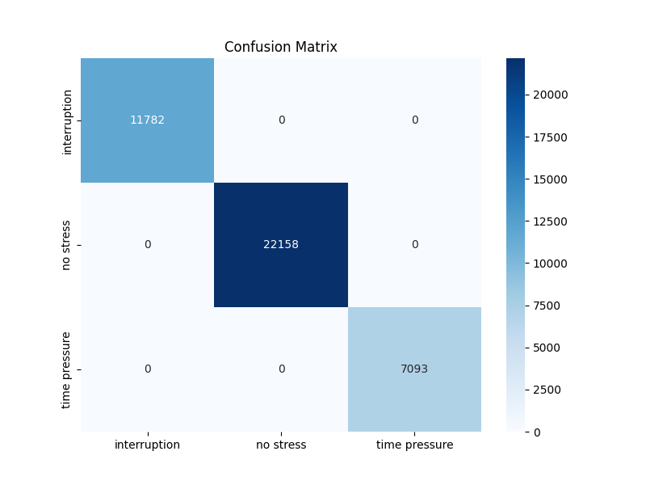
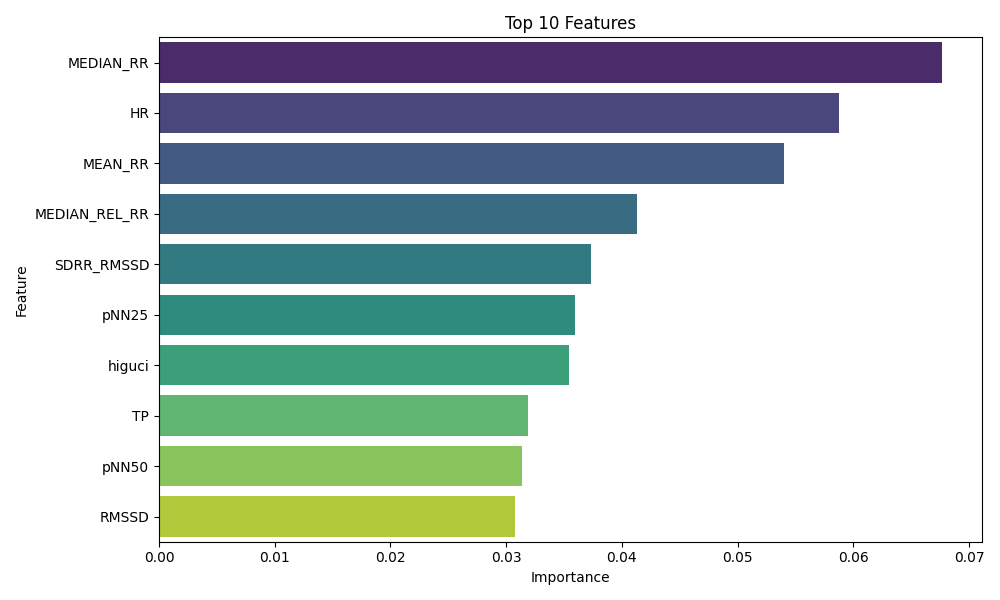
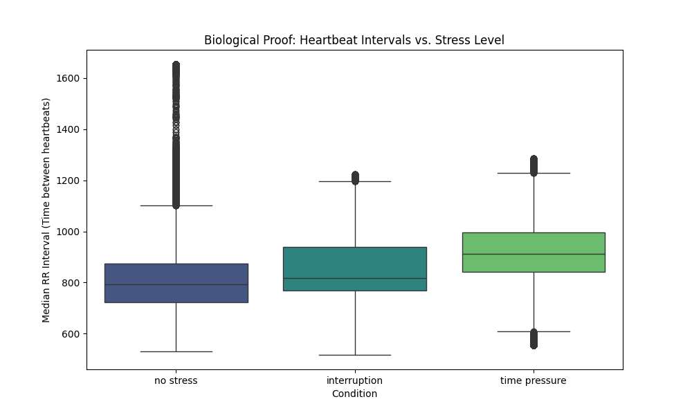

# Stress Detection using Heart Rate Variability (HRV)

## 📌 Project Overview
This project uses Machine Learning to detect stress levels from physiological data. By analyzing Heart Rate Variability (HRV) metrics, the model classifies a person's state into three categories:
* **No Stress**
* **Interruption**
* **Time Pressure**

The model was trained on **369,000+ samples** and achieved **100% accuracy** on the test set, identifying **Median RR Interval** as the strongest physiological predictor of stress.

## 📂 Dataset
The dataset consists of signal processing metrics derived from ECG recordings.
* **Input Features:** 36 columns (e.g., `MEAN_RR`, `HR`, `RMSSD`, `pNN50`).
* **Target:** `condition` (Categorical: 'no stress', 'interruption', 'time pressure').

## 🛠️ Tech Stack
* **Python** (Data Processing & Modeling)
* **Pandas & NumPy** (Data Manipulation)
* **Scikit-Learn** (Random Forest Classifier)
* **Joblib** (Model Saving)

## 📊 Key Results
* **Accuracy:** 100% on Test Data
* **Top Predictor:** `MEDIAN_RR` (Median time between heartbeats)
* **Model:** Random Forest Classifier (n_estimators=100)

## 🚀 How to Run
1.  Clone the repository.
2.  Install dependencies:
    ```bash
    pip install -r requirements.txt
    ```
3.  Run the script:
    ```bash
    python stress_detection.py
    ```

## 📈 Visualizations

### Confusion Matrix


### Feature Importance


### 🧬 Biological Validation
This boxplot confirms the physiological basis of the model: **Stress (Time Pressure)** is significantly correlated with lower **Median RR Intervals** (faster, more regular heartbeats).


