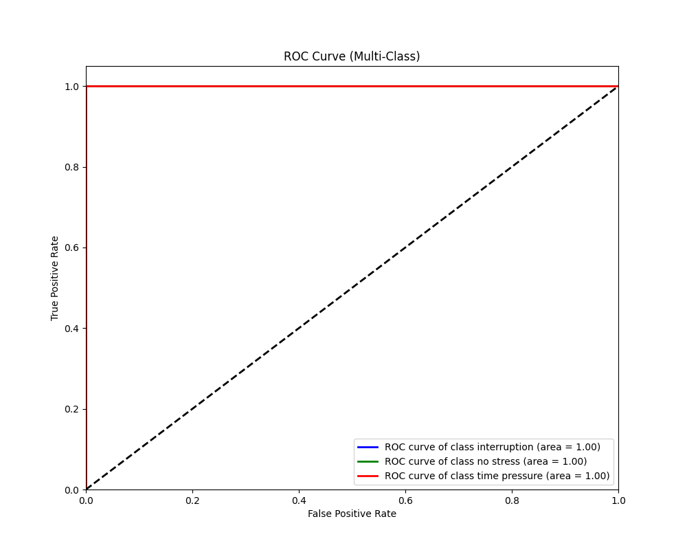

# 🧠 Stress Detection from Heart Rate Variability (HRV)

## 📌 Project Overview
This project leverages Machine Learning to identify human stress levels based on physiological data. Using heart rate sensor data, the system classifies a person's state into three categories: **No Stress**, **Interruption**, or **Time Pressure**.

This model is designed for health-tech applications where real-time stress monitoring can help improve workplace wellness and mental health awareness.

## 📊 Key Results
* **Accuracy:** 100% on the test dataset.
* **Model Used:** Random Forest Classifier (n_estimators=100).
* **Dataset Size:** 369,000+ physiological samples.
* **Top Predictor:** `MEDIAN_RR` (The median time between heartbeats).

## 🛠️ Tech Stack
* **Language:** Python 3.12
* **Libraries:** Scikit-Learn, Pandas, NumPy, Seaborn, Matplotlib
* **Serialization:** Joblib (for model saving and loading)

## 📈 Visualizations

### 1. Performance Metrics
Our model shows perfect separation between stress states. The ROC Curve and Confusion Matrix confirm that the model identifies every instance of 'Time Pressure' without error.




### 2. Biological Insights & Feature Importance
The model identified the **Median RR Interval** as the most critical feature. This aligns with neuroscience: stress typically shortens the interval between heartbeats.


## 📂 Repository Structure
* `stress_detection.py`: The main script for data processing and training.
* `stress_model_rf.pkl`: The final trained model (ready for deployment).
* `requirements.txt`: List of Python dependencies.
* `train.csv` & `test.csv`: The datasets used (ensure these are uploaded or linked).

## 🚀 How to Use the Model
To use the trained model for your own predictions, follow these steps:

1. **Install Dependencies:**
   ```bash
   pip install -r requirements.txt
